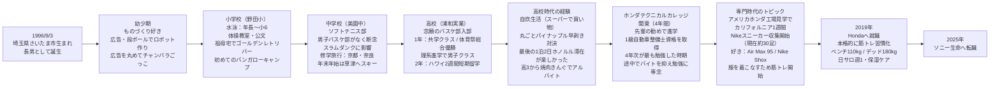
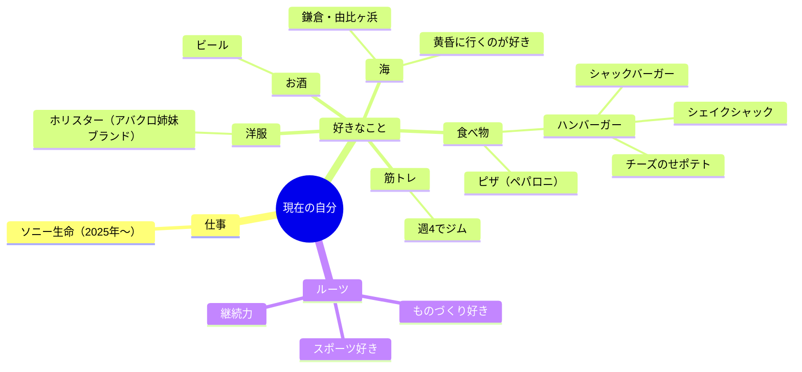

# 自己紹介（図解）

## 1) 人生年表（Timeline）

```mermaid
flowchart LR
    A["1996/9/3<br/>埼玉県さいたま市生まれ<br/>長男として誕生"] --> B["幼少期<br/>ものづくり好き<br/>広告・段ボールでロボット作り<br/>広告を丸めてチャンバラごっこ"]
    B --> C["小学校（野田小）<br/>水泳：年長〜小6<br/>体操教室・公文<br/>祖母宅でゴールデンレトリバー<br/>初めてのバンガローキャンプ"]
    C --> D["中学校（美園中）<br/>ソフトテニス部<br/>男子バスケ部がなく断念<br/>スラムダンクに影響<br/>修学旅行：京都・奈良<br/>年末年始は草津へスキー"]
    D --> E["高校（浦和実業）<br/>念願のバスケ部入部<br/>1年：共学クラス / 体育祭総合優勝<br/>理系進学で男子クラス<br/>2年：ハワイ2週間短期留学"]
    E --> F["高校時代の経験<br/>自炊生活（スーパーで買い物）<br/>丸ごとパイナップル早剥き対決<br/>最後の1泊2日ホノルル滞在が楽しかった<br/>高3から焼肉きんぐでアルバイト"]
    F --> G["ホンダテクニカルカレッジ関東（4年間）<br/>先輩の勧めで進学<br/>1級自動車整備士資格を取得<br/>4年次が最も勉強した時期<br/>途中でバイトを抑え勉強に専念"]
    G --> H["専門時代のトピック<br/>アメリカホンダ工場見学でカリフォルニア1週間<br/>Nikeスニーカー収集開始（現在約30足）<br/>好き：Air Max 95 / Nike Shox<br/>服を着こなすため筋トレ開始"]
    H --> I["2019年<br/>Hondaへ就職<br/>本格的に筋トレ習慣化<br/>ベンチ110kg / デッド180kg<br/>日サロ週1・保湿ケア"]
    I --> J["2025年<br/>ソニー生命へ転職"]
```

## 2) 現在のプロフィール（Now）

```mermaid
mindmap
  root((現在の自分))
    仕事
      ソニー生命（2025年〜）
    好きなこと
      洋服
        ホリスター（アバクロ姉妹ブランド）
      筋トレ
        週4でジム
      お酒
        ビール
      食べ物
        ピザ（ペパロニ）
        ハンバーガー
          シェイクシャック
          シャックバーガー
          チーズのせポテト
      海
        黄昏に行くのが好き
        鎌倉・由比ヶ浜
    ルーツ
      ものづくり好き
      スポーツ好き
      継続力
```

## 3) ひとこと

> 「好き」を積み重ねて、行動で人生を切り拓いてきました。
